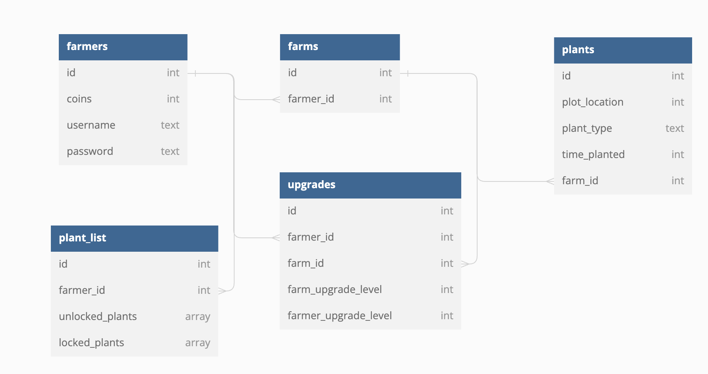

## FarmLand 🌱🌿🌵☘️🌳

## Introduction 

Our app is a fun and interactive pixelated game where a user can use an in game currency to buy seeds and plant them. Users will be able to earn more currency by harvesting the plants that they grow,  and from being active. A user can also use their currency to upgrade their farm and upgrade plant functions.

## Wireframes

## Wants

- [ ] Time based -- takes current time vs last time accessed to determine passage of time, crop saves a login timestamp

- [ ] Save locally/have a login -- find a way to make login persist to cut down on time to access

- [ ] Gameboy Advanced style Graphics -- Pixel Art

- [ ] Different Crops -- with different yields and grow time

- [ ] Farm Upgrading -- faster harvest times

- [ ] Spendable Currency -- establish initial amount and recurring return for harvests

- [ ] Change image of plant based off growth percentage -- visual change with pixel art

- [ ] Tailwind for CSS -- utilizing new tools to build frontend display

- [ ] Progressively Alien Plants -- mutations and/ or exotic plant upgrades

- [ ] Activity -- monitors user activity and how often they are using the app
